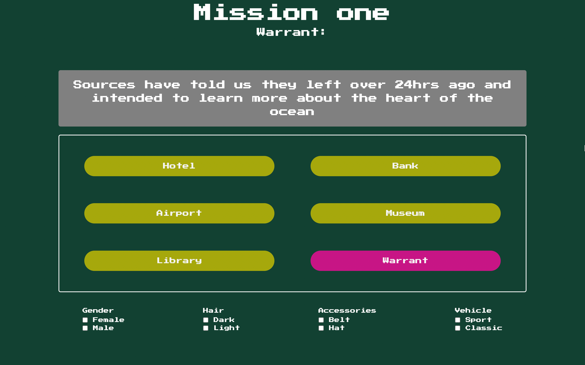
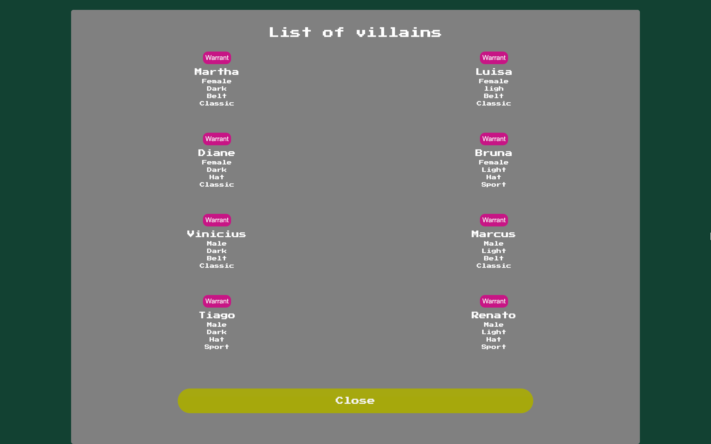

# CARMEN-SANTIAGO

- My very first JS project. Game that resembles the classic 'Where in the world is Carmen Sandiego' game. (I have no rights over Carmen Sandiego)

[Live here](https://carmen-santiago.netlify.app/)

# TECH:

[TRIAD]: HTML, CSS, JS

# THE IDEA:

- During my web dev learning journey, following tutorials never really did the job for me. It mostly bores me.

- Therefore, I would have the tutorial go on, while having a personal little project going on.

- I simply get the 'concept' being implemented in that particular tutorial, and apply to my own project.

[IT_WASN'T_DIFFERENT]

- Carmen Sandiego was a game that I enjoyed a lot during my childhood. Suddenly the idea for my project was set. A game... A mock game

# THE PROJECT

- You are a new detective prompted to enter your name at first access.

- My limited knowledge added that just to make it look cool, considering you can press confirm and continue whether a name is entered on not

- The second page is a welcome from the crew you are working with. They are friendly and explain to you the basics of the game

- The game consists of you traveling from one location to the next attempting to get clues that will lead to the correct location of the villain

- You will never be able to find the villain at first try, it follows a mapped pattern

ex: You first must go to the hotel, the next correct location is the bank, then the museum, etc...

- You also have a checkbox list available for personal use that has zero effect on the game itself... it basically just helps you remember the clues you have gather so far

- You have available a warrant section. When clicked, you get a list of villains with their descriptions.

- Matching the descriptions with the clues you get, is how you dicover who the villain is

- In this section, you also have the ability to issue a warrant. You can issue the warrant as many times as you please, as long as once you find the villain, the correct warrant is issued

[GAME-START]

- At game start, you get an initial prompt from your crew. That's your first clue to the next correct location

- If you click on the wrong location, you get a default text. If you click on the correct location, you get a clue to where you should go next, and who the villain might be

- As you travel, you keep track of the clues with the personal use checkbox list, and verify on the warrant list whose villain's characteristics match your clues

- When you feel ready, you may issue a warrant, which will reveal a confirmation text stating that a warrant had been issued, and the name of the villain

[WIN_LOSE_CONDITIONS]

- If no warrant is issued when you find the villain, its game over.

- If a warrant is issued to the worng person when you find the villain, its game over

- If a warrant is issued to the correct villain when you find them, player wins

[GAME-CONTINUITY]

- If you win the current mission, you get to go to the next. You warrant list will now show that the previous villain is in jail.

- This allows for campaign style gaming, arresting one villain per mission until finally you get to carmen

[SPOILER]

- Carmen can't get caught because she's trully a bad@ss.

# APPROACH

[html]: Contains all elements seen on screen. Each mission has its own file and reaches the next via anchor tags

[css]: Design is meant to resemble a throw back vintage game

[js]: Each mission has its own file as all elements on html require dynamically inserted texts, and game logic changes

[DEVELOPER: ARYSE GABRIELLE TANSY]
[EMAIL: medictansy@gmail.com]
[PHONE]: 754-367-0607 -> text/voicemail
